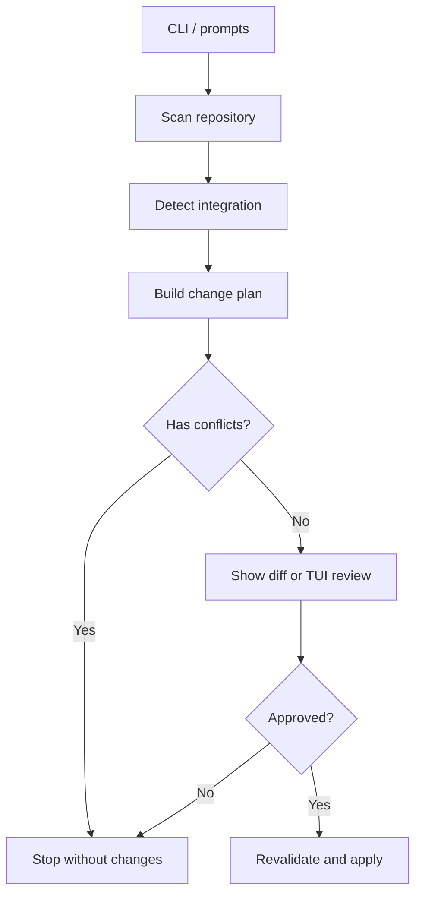
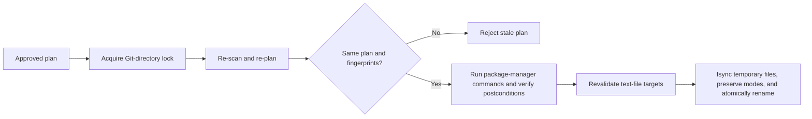

# RFC 0001: Plan-first `config setup`

- **Status:** Proposed
- **Date:** 2026-08-27
- **Decision:** Replace the imperative `init` flow with a plan-first `setup` command.

## Context

The existing ESLint initializer changes packages and files in one path. It cannot show every change before it writes, reject stale state, or represent an unclear configuration as a conflict. See [`packages/eslint/src/init.ts`](../../packages/eslint/src/init.ts).

The replacement must set up a repository safely. The first integration sets up Oxlint and Oxfmt: it installs the required packages, creates missing baseline configs, and adds both commands to Lefthook. It updates an existing Lefthook `pre-commit` hook or creates a YAML config when none exists.

## Decision

### Command surface

```text
config setup [integration] [--cwd <directory>] [--review] [--yes]
```

- `config setup` prompts for an integration, then scans, reviews, and asks for approval.
- `config setup oxlint` skips the integration prompt. It still reviews and asks for approval.
- `--cwd` finds the Git repository root. The first release needs its root `package.json`; it cannot target a workspace leaf.
- The default review is a portable unified diff. It uses color when supported.
- `--review` shows an OpenTUI multi-file diff. It needs a TTY and includes approval.
- `--yes` is the only non-interactive approval. It needs an explicit integration and cannot be combined with `--review`.
- There is no `--force`, compatibility `init` command, or implicit apply mode.

A conflicted plan cannot apply. A declined plan writes nothing.

### Architecture

Repository I/O and process commands are Effect services. Planning is pure and uses one immutable repository snapshot.



```ts
interface Integration<State> {
  readonly id: IntegrationId
  readonly detect: (snapshot: RepositorySnapshot) => State
  readonly plan: (state: State, policy: SetupPolicy) => ChangePlan
}
```

`RepositorySnapshot` records raw source bytes, file fingerprints, candidate config paths, package-manager facts, and Git-hook facts. It cannot write to the filesystem or run a process.

Modules:

- `repository`: Git root resolution, path validation, raw reads, fingerprints, symlink checks, and repository locking.
- `setup/plan`: action types, plan invariants, semantic plan comparison, and conflicts.
- `setup/oxlint`: Oxlint-specific detection and planning.
- `setup/oxfmt`: Oxfmt-specific detection and planning.
- `setup/lefthook`: format detection plus format-specific semantic editors.
- `setup/typescript`: TypeScript config classification and narrow source patches.
- `setup/package-manager`: package-manager detection and structured command rendering.
- `setup/review`: unified diff and OpenTUI views of the same immutable plan.
- `setup/apply`: revalidation, process boundaries, atomic file replacement, and result reporting.

### Plan actions

`Action` is an internal `Data.TaggedEnum` value. It is not a CLI wire format.

```ts
type Action = Data.TaggedEnum<{
  readonly Create: { readonly path: string; readonly contents: string; readonly expected: 'missing' }
  readonly Update: { readonly path: string; readonly before: string; readonly after: string; readonly expected: string }
  readonly Command: { readonly cwd: string; readonly executable: string; readonly args: ReadonlyArray<string> }
  readonly NoChange: { readonly target: string; readonly reason: string }
  readonly Conflict: { readonly paths: ReadonlyArray<string>; readonly reason: string; readonly remediation: string }
}>

const Action = Data.taggedEnum<Action>()
```

All paths are normalized and repository-relative. `Create` and `Update` own exact UTF-8 source. An `Update` has the full before and after content; review shows only changed hunks. A `Command` has an executable and argument vector, never a shell string.

A plan records its detection inputs, ordered actions, stable digest, and action dependencies. The planner rejects path escape, duplicate writers, invalid update fingerprints, and plans with conflicts.

### Oxlint and Oxfmt integration

The base config comes from the current documented Oxlint package surface:

```ts
import { defineConfig } from 'oxlint'
import { base } from '@macklinu/oxlint-config'

export default defineConfig({
  extends: [base],
})
```

See [`packages/oxlint/README.md`](../../packages/oxlint/README.md).

Initial state handling:

- Missing `oxlint.config.ts` → `Create` the baseline config.
- Existing config that already extends the required `base` config → `NoChange`.
- Any other existing Oxlint config → `Conflict`.

Do not reprint an existing TypeScript config. Later support may use the TypeScript parser and span-based edits for a canonical static `export default defineConfig({ extends: [...] })` form only. Dynamic exports, spreads, unclear aliases, and multiple default exports remain conflicts.

Oxfmt uses a baseline `.oxfmtrc.json`:

```json
{
  "$schema": "./node_modules/oxfmt/configuration_schema.json"
}
```

Initial state handling:

- Missing `.oxfmtrc.json` → `Create` the baseline config.
- Existing `.oxfmtrc.json` → `NoChange`.

### Lefthook integration and installation

Lefthook supports YAML, TOML, JSON, and JSONC main configs in several documented locations. The scanner finds every documented main config and `lefthook-local` overlay. It does not guess which of several main configs Lefthook will use.

The planner targets `pre-commit.commands.oxlint` and `pre-commit.commands.oxfmt`. Each format needs its own source-preserving editor; a YAML parser is not a generic Lefthook editor.

The first write adapter accepts zero or one main YAML config. An existing config must have a mapping-shaped `pre-commit.commands`; when none exists, the adapter creates `lefthook.yml` with that shape. It inserts a command only when its identifier is absent:

```yaml
pre-commit:
  commands:
    oxlint:
      glob: '*.{js,cjs,mjs,jsx,ts,cts,mts,tsx}'
      run: pnpm exec oxlint "{staged_files}"
    oxfmt:
      glob: '*.{js,cjs,mjs,jsx,ts,cts,mts,tsx}'
      run: pnpm exec oxfmt "{staged_files}"
```

The command renderer uses `pnpm exec` in a pnpm repository and `nubx` in a Nub repository. It validates with a YAML CST parser, then inserts a token span. It never parses and stringifies the whole document, and it preserves every byte outside the inserted node.

The first slice reports a conflict for:

- a non-YAML config or more than one main config;
- `jobs`, malformed YAML, or duplicate keys; or
- an existing different `oxlint` or `oxfmt` command.

Future TOML, JSON, and JSONC adapters must preserve source bytes in the same way.

`lefthook install` is separate. Lefthook reads its config whenever its installed hook runs. The Lefthook npm package also installs hooks from its postinstall script. See [Lefthook install](https://lefthook.dev/usage/commands/install/).

The first slice never runs `lefthook install`. It changes Git hooks, and the scanner cannot safely overwrite a custom hook. A later `--install-hook` mode may add `Command { executable: "lefthook", args: ["install", "pre-commit"] }` only when the main config exists and the target hook is absent or conclusively Lefthook-managed. Any custom or unknown hook is a conflict.

### Package-manager commands

Package-manager detection is pure:

1. Read `package.json#packageManager`.
2. Compare it with recognized lockfiles.
3. Require agreement and a known executable.
4. Otherwise report a conflict.

Never guess npm, invoke Corepack, or install a package manager. An adapter renders the command. The first slice supports only pnpm and Nub:

```text
pnpm add --save-dev --ignore-scripts \
  oxlint@<compatibility-version> \
  @macklinu/oxlint-config@<compatibility-version> \
  oxfmt@<compatibility-version>

nub add --save-dev --ignore-scripts \
  oxlint@<compatibility-version> \
  @macklinu/oxlint-config@<compatibility-version> \
  oxfmt@<compatibility-version>
```

Use `--workspace-root` only for a pnpm or Nub workspace root. The CLI ships an exact compatibility matrix; it never uses `latest` or mutable ranges. Compatible packages are `NoChange`. An incompatible version or unclear dependency location is a conflict.

`--ignore-scripts` blocks unreviewed dependency lifecycle scripts. The review must say that the command changes `package.json` and the lockfile. Package-manager output cannot have a truthful static diff before the command runs.

### Revalidation and apply



Each file replacement is atomic. The full operation is not atomic across package-manager commands and multiple files. On failure, report completed actions. Do not auto-rollback: it can overwrite concurrent user changes and cannot safely undo package-manager side effects.

## Delivery order

1. Plan model, repository snapshot, conflict rendering, default diff review, approval, and pure fixture tests.
2. First vertical slice: Oxlint and Oxfmt, a pnpm or Nub repository root, missing-or-correct baseline configs, zero or one supported Lefthook YAML config, stale-plan check, and atomic text writes.
3. Boundary tests: comments and anchors, malformed or duplicate YAML, a new conflicting config file, symlink escape, stale source, command failure, and partial-write reporting.
4. OpenTUI review, then format adapters and package-manager adapters one at a time.
5. Narrow TypeScript edits and explicit safe hook installation.

## Out of scope for the first vertical slice

- Installing Lefthook.
- Automatic `lefthook install`.
- TOML, JSON, JSONC, multiple config files, `lefthook-local` mutation, and `jobs` mutation.
- Editing a non-canonical Oxlint TypeScript config.
- Workspace leaf targets, package-manager bootstrap, dependency upgrades, or package-manager support beyond pnpm and Nub.
- Automatic React, Vitest, Node, or type-aware Oxlint profile selection.
- `--force`, shell command strings, global reformatting, persisted plans, JSON output, and automatic hook execution.

## Consequences

Setup stops when a safe configuration needs a guess. The first release supports fewer repository shapes, but every supported shape has a reviewable plan, stale-state protection, and a small source-preserving change. New shapes need explicit adapters.
